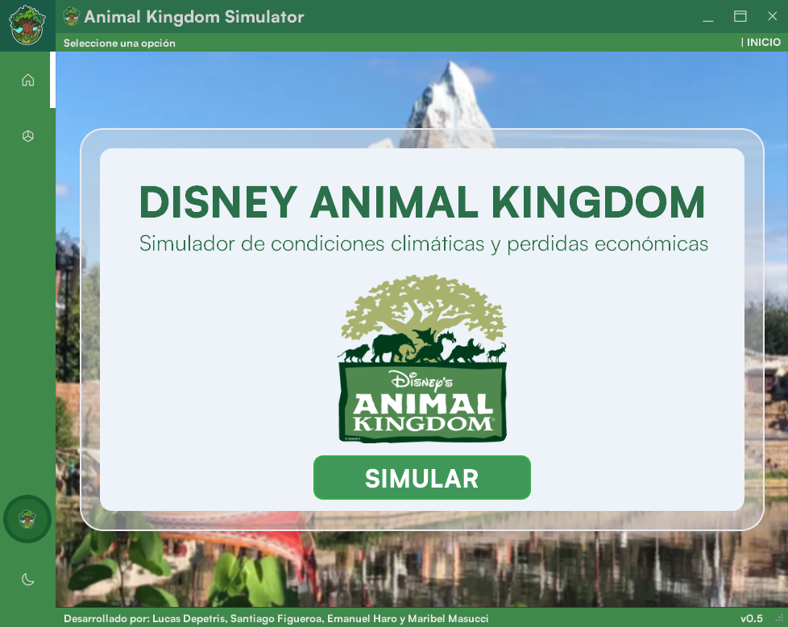
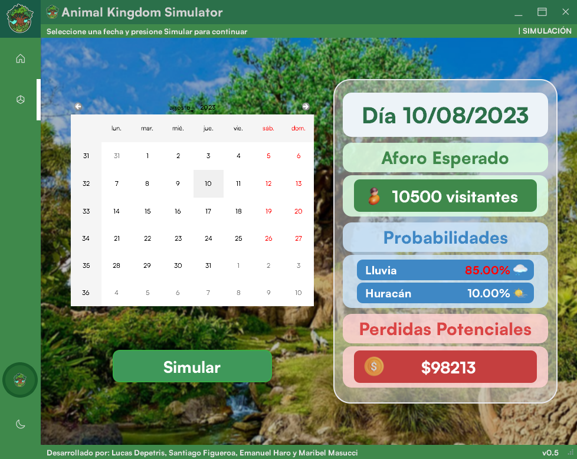

#  Simulador Animal Kingdom 

Simulador de eventos metereológicos e impactos financieros en el parque Animal Kingdom. Creado para la materia Simulación de 4to año en UTN-FRT.

Desarrollado por: 
- [Lucas Depetris](https://github.com/lucasdepetrisd)
- [Santiago Figueroa](https://github.com/SantiFigueroa00)
- [Maribel Masucci](https://github.com/maribelmasucci)
- [Emanuel Haro](https://github.com/EmanuelHaro)

# 📷 SCREENSHOTS

<p align="center">
    
<p/>

<p align="center">
    
<p/>

# ⬇ INSTALACIÓN / INSTALL:
1. [Descargar la última release](https://github.com/SimuTeam/SimuladorAK/releases/latest).
2. Descomprimir.
3. Ejecutar archivo .exe.

<!-- #  FUNCIONES  -->

# 💻 DESARROLLO / DEVELOPING:

## ⬇ MODULOS / MODULES:

> ```sh
> pip install PyQt5
> ```
> 

## ⚙ EJECUTAR / RUN:
> ```sh
> py main.py
> ```
